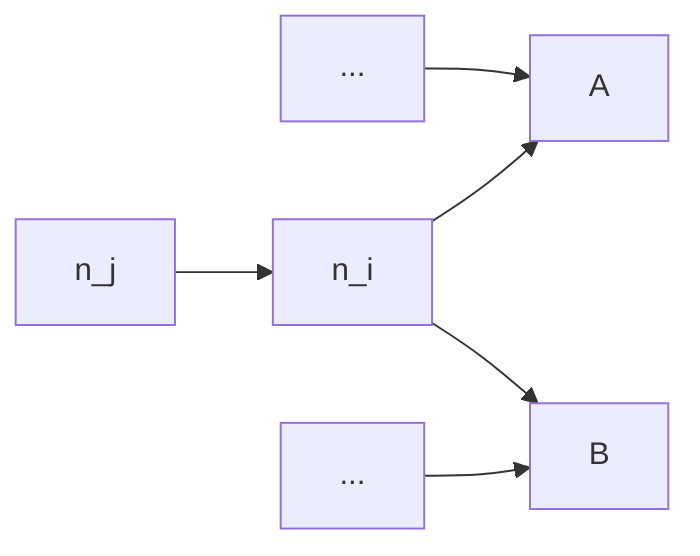
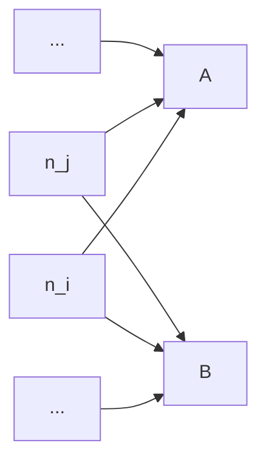
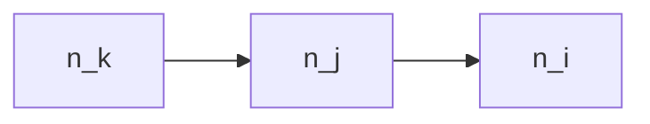
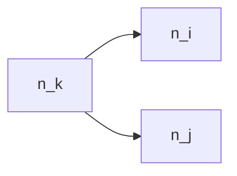

bazel-dep-reduce
================

Dependency Reduction for Bazel

## Pushing the Limit of Previous Works

### Dynamic Dependency Analysis via [`buildfuzz`]

[`buildfuzz`] is basically the reproduction of the build fuzz testing algorithm proposed by 
[`mkcheck`] (https://github.com/nandor/mkcheck) with a new feature:

1. Use **custom touchers** instead of the `touch` file operation, 
   which will **CHANGE** the file content but not affect the original functionality.
1. Use **SHA256** instead of timestamp to detect file changes.
1. **Restore** touched file content after every round.
1. **Rebuild** the project before every round.

You may wonder why we bother changing the source code instead of just touching them. 
The reason is that Bazel has a very powerful dirtiness checking logic, which means, simply touching a file
will not cause Bazel to rebuild.

Do you think custom touchers just add comments into
the source code? If so, you are wrong. We have to make
custom touchers modify the source code that could further
change the object file. Otherwise, we cannot track the 
dependencies between the object files and the linked artifacts
such as the executables. Bazel is too smart to re-link the
object files without real changes of them. 
See [Skyframe - Bazel] for details.

So, what we do with custom touchers is actually adding a dummy
static thing such as static function into the source code.
But it introduces some risks such as unused function warnings, 
which may cause build failures if the project has settings 
to treat warnings as errors. There are also risks like conflicted symbols,
invalid syntaxes in some special contexts (e.g. a header file used as a database) 
and so on.

What's more, even if we added a new function into the source code, there could be 
a chance that the change stop propagating to its dependents 
(e.g. the unused function might be pruned in the object file).
In such cases, we could lose the tracking of dependencies and get inaccurate results.

Anyway, by using custom touchers, we do make it possible to apply the build fuzz 
testing method to Bazel build system.

#### About Redundant Dependency Detection

[`mkcheck`] uses build fuzzing method, which can get more accurate actual dependencies. 
However, in some cases, such as using Java, if you change a library,
and compile an executable depending on this library, even though the executable 
does not use the library in the source code, as long as you specify the dependency 
in the build script, the executable jar will be repackaged, and of course, modified.

Same thing happens for C/C++, while linking `liba.o` and `libb.o` to `main`, 
even though `main` does not need `libb` in its source code. 
Thus, the original [`mkcheck`] cannot detect redundant dependency very well.

To mitigate this issue, we detect file changes by SHA256 instead of the timestamp. This is feasible
because we don't just touch the file but modify the file using custom touchers. And in this way,
we can ensure the modified files are truly changed.

Nevertheless, it can miss some dependencies too. When archiving a
static library depending on other static libraries, it won't actually package those 
dependencies into the current static library. Jar package in Java works similarly.
So, for these kinds of artifacts, if we modify their dependencies, they keep the same.
And their dependencies cannot be captured by [`mkcheck`] or build fuzzing method.

You can try to run [`buildfuzz`] on `examples/kotlin-transitive` project.
And you will find that `libd.jar` only depends on `ClassD.kt`, which
definitely misses a lot.

#### How to Run [`buildfuzz`]

```sh
buildfuzz --input examples/simple-cxx-project \
    --artifact examples/simple-cxx-project/bazel-bin \
    --command buildfuzz/src/test_data/build.sh \
    --output result_deps.log
```

The result is a JSONL file like below.

```
["a.o",["a.h","a.c"]]
["b.o",["b.h","b.c"]]
["main.o",["main.c","a.h","b.h"]]
["main",["main.o","a.o","b.o"]]
```


### Dynamic Dependency Analaysis via [`strace_parser`]

[`strace_parser`] is basically the reproduction of [`buildfs`] (https://github.com/theosotr/buildfs) with some improvements:

1. **`stat`/`lstat`/`statfs` syscalls were ignored** because we don't know if the accessed file truly exists, 
   and they are mostly used to detect file changes, i.e., usually not a real sign of file consumption.
1. **Syscalls returning -1** will be ignored, because they failed mostly for inexistent files.
1. **`clone3` syscall was added** for tracing. Otherwise there will be many missing `Newproc` operations.
1. **`--decode-pids=pidns,comm` was added** as the arguments of `strace`, to resolve the pid within a separate namespace, which is the case of Bazel sandboxing. Otherwise, the pids returned by `clone` or `fork` cannot match the pids traced by `strace` in its own namespace, which prevents us from tracing the process relationship correctly.
1. A **virtual filesystem** was implemented to track symlinks. Bazel creates lots of symlinks because of sandboxing.
1. A **`to_link` operation was added** to DSL (IR) to support tracking symlinks.


Though [`buildfs`] claims their approach is applicable to other build systems including Bazel.
The fact is, without our efforts, it is really hard to apply it to Bazel.

See [Sandboxing - Bazel] for details about the sandboxing mechanism in Bazel.

#### About Redundant Dependency Detection

[`buildfs`] does not support to detect redundant dependencies. 
This is because when you specified a dependency in build script,
even if it was not used in the source code, the compiler or linker
will still access the dependency file to finish compilation or linking.

For example, suppose `main.cpp` doesn't include `a.h`, 
but we specify `liba` as a dependency of `main` executable.
When we compile `main.cpp` to `main.o`, the dynamic analysis could work
here, because the compiler will only access all headers included in the `main.cpp`
and does not need to access any other manually-specified dependencies.
However, when it comes to linking, i.e. `main.o` to `main`, all specified
dependencies such as `liba` will be passed to the linker command-line, leading to the file
access on those redundant dependncies. Nothing can be done by dynamic analysis to catch them.

It happens to other programming languages too, especially to those languages without header, such as Java.

[`BuildChecker`] uses the same dynamic approach to detect redundant dependencies.
But in fact, it only supports GNU Make, of which the build dependencies
are based on file instead of target and are more fine-grained. 
So, it could be able to find some of redundant dependency errors, but still has opportunities to miss a lot of them.

#### How to Run `strace`

```sh
bazel clean --expunge
bazel shutdown
strace -s 300 \
    -f \
    -e access,chdir,chmod,chown,clone,clone3,close,dup,dup2,dup3,execve,fchdir,fchmodat,fchownat,fcntl,fork,getxattr,getcwd,lchown,lgetxattr,lremovexattr,lsetxattr,link,linkat,mkdir,mkdirat,mknod,open,openat,readlink,readlinkat,removexattr,rename,renameat,rmdir,symlink,symlinkat,unlink,unlinkat,utime,utimensat,utimes,vfork,write,writev \
    --decode-pids=pidns,comm \
    -o strace.log \
    bash ../build_for_strace.sh
```

#### How to use [`strace_parser`]

```sh
strace_parser -i examples/simple-java-project/strace.log -c examples/simple-java-project -o result_deps.log
```

The result is a JSONL file like below.

```
["a.o",["a.h","a.c"]]
["b.o",["b.h","b.c"]]
["main.o",["main.c","a.h","b.h"]]
["main",["main.o","a.o","b.o"]]
```


## What Makes a Good Dependency Graph?

Our goal is to minimize the number of targets that must be rebuilt when any node in the graph changes.

### Node

Let $n_i$ denote a node in the dependency graph. 
A node may represent a build target, a source file, or a generated file. 

Let $N$ denote the total number of nodes in the graph.

### Dependencies

Let:

- $\text{deps}(n_i)$: the set of all (declared) dependencies of $n_i$
- $\text{deps}_{\text{real}}(n_i)$: the set of all **actual** direct dependencies required for a successful build

#### Transitive Dependencies

$$
\text{deps}_{\text{trans}}(n_i) = \text{deps}(n_i) \cup \bigcup_{n_j \in \text{deps}(n_i)} \text{deps}_{\text{trans}}(n_j)
$$

### Dependents

Let $\text{dependents}(n_i)$ denote the set of all nodes that depend on $n_i$, i.e.,

$$
n_j \in \text{dependents}(n_i) \iff n_i \in \text{deps}(n_j)
$$

#### Transitive Dependents

$$
\text{dependents}_{\text{trans}}(n_i) = \text{dependents}(n_i) \cup \bigcup_{n_j \in \text{dependents}(n_i)} \text{dependents}_{\text{trans}}(n_j)
$$

### Edges

If $n_j \in \text{deps}(n_i)$, we say there is a directed edge $e_{i,j}$ from $n_i$ to $n_j$.

### In-Degree and Out-Degree

- In-degree of $n_i$: number of incoming edges
  $d_{\text{in}}(n_i) = |\text{dependents}(n_i)|$

- Out-degree of $n_i$: number of outgoing edges
  $d_{\text{out}}(n_i) = |\text{deps}(n_i)|$

### Correctness Criterion

A build is considered correct if:

$$
\forall i, \quad \text{deps}_{\text{real}}(n_i) \subseteq \text{deps}_{\text{trans}}(n_i)
$$

That is, every actual dependency of a node must be reachable via its declared transitive dependencies.

### Rebuild Cost

Let $R_i$ denote the number of nodes (excluding $n_i$ itself) that must be rebuilt when $n_i$ changes:

$$
\begin{aligned}
R_i &= |\text{dependents}_{\text{trans}}(n_i)| \\
    &= \left| \text{dependents}(n_i) \cup \bigcup_{n_j \in \text{dependents}(n_i)} \text{dependents}_{\text{trans}}(n_j) \right|
\end{aligned}
$$

Our global optimization goal is:

$$
\min R_{\text{sum}} = \min \sum_{i=1}^N R_i
$$

## Optimization Strategy via Topological Order

Let $n_1, n_2, \dots, n_N$ be a topological ordering of the nodes such that:

$$
n_j \in \text{deps}(n_i) \Rightarrow j > i \quad \text{and} \quad n_j \in \text{dependents}(n_i) \Rightarrow j < i
$$

This implies:

$$
\begin{aligned}
\text{dependents}(n_i) &\subseteq \{ n_j \mid j < i \} \\
\text{deps}(n_i) &\subseteq \{ n_j \mid j > i \}
\end{aligned}
$$

We process nodes in increasing topological order to minimize $R_i$ incrementally.

For instance:

$$
\text{dependents}(n_1) = \emptyset \Longrightarrow R_1 = 0 
$$

For $n_i$ in general:

$$
\begin{aligned}
R_i &= \left| \text{dependents}(n_i) \cup \bigcup_{n_j \in \text{dependents}(n_i)} \text{dependents}_{\text{trans}}(n_j) \right| \\
&\leq |\text{dependents}(n_i)| + \sum_{n_j \in \text{dependents}(n_i)} R_j \\
&= \sum_{n_j \in \text{dependents}(n_i)} (1 + R_j)
\end{aligned}
$$

Since all $R_j$ with $j < i$ are already minimized, we can now focus on reducing this upper bound for $R_i$.

### How to Minimize $R_i$?

It's hard to optimize the original $R_i$. Let us assume there is no overlap of dependents and 
minimize the upper bound of it, i.e. $\bar R_i$.

$$
\min \bar R_i = \min \sum_{n_j \in \text{dependents}(n_i) \subseteq \left\{ n_j | j < i \right\}} (1 + \bar R_j)
$$

To minimize it, we need to remove the dependents of $n_i$ as more as possible.
And by removing $n_j \in \text{dependents}(n_i)$, $\bar R_i$ will be decreased by $1 + \bar R_j$.

### Strategy for Removing a Dependent

Process each $n_j \in \text{dependents}(n_i)$ in reverse topological order

1. Remove $n_j \rightarrow n_i$ and attempt to build.
2. If it fails, replace $n_i$ with $\text{deps}(n_i)$ in $n_j$'s dependency list and try again.
3. If still failing, add $n_i$ as a dependency to all $\text{dependents}(n_j)$ and retry.
4. If all fail, retain the original edge.

#### Step 2: Dependency Flattening

You may wonder whether the step 2 really reduce the sum of $\bar R$,
as it adds some new dependencies and seems to increase the $\bar R_k$ at the same time where $n_k \in deps(n_i)$.
In fact, $\bar R_k$ won't be changed. Let's do some calculations.

##### Motivating Example

Suppose $n_j$ depends on all $deps(n_i)$ transitively thru $n_i \in deps(n_j)$, but 
$n_j$ does not actually depend on $n_i$.



In such case, we replace the $n_i$ with all its dependencies as the dependencies of $n_j$.



Let's see the change of $\bar R$ for this.  Let $\bar R_*'$ be the updated value of $\bar R_*$.

For $n_i$ that is currently being optimized, $\bar R_i' = \bar R_i - (1 + \bar R_j)$.

For $n_k \in deps(n_i)$, let $D_k$ be $dependents(n_k)$ before optimization and $D_k'$ be $dependents(n_k)$ after optimization.

We have $D_k' = D_k \cup \{n_j\}$. And for $\forall n_t \in D_k \setminus n_i$, there is no change to $\bar R_t$, i.e., $\bar R_t' = \bar R_t$.

$$
\begin{split}
\bar R_k & = \sum_{\forall n_t \in D_k} (1 + \bar R_t) \\
    & = \sum_{\forall n_t \in D_k \setminus n_i} (1 + \bar R_t) + (1 + \bar R_i) \\
\\
\bar R_k' & = \sum_{\forall n_t \in D_k' \setminus n_i} (1 + \bar R_t') + (1 + \bar R_i') \\
     & = \sum_{\forall n_t \in D_k \cup \{n_j\} \setminus n_i} (1 + \bar R_t') + (1 + \bar R_i') \\
     & = \sum_{\forall n_t \in D_k \setminus n_i} (1 +\bar R_t') + (1 + \bar R_j) + (1 + \bar R_i') \\
     & = \sum_{\forall n_t \in D_k \setminus n_i} (1 +\bar R_t) + (1 + \bar R_j) + (1 + \bar R_i - (1 + \bar R_j)) \\
     & = \sum_{\forall n_t \in D_k \setminus n_i} (1 +\bar R_t) + (1 + \bar R_i) \\
     & = \bar R_k
\end{split}
$$

So, $\bar R_k$ actually does not change and $\bar R_i$ decreased by $1 + \bar R_j$. 
The overall sum of $\bar R$ will be definitely reduced.

Intuitively, we just avoid rebuilding $n_j$ and all its dependents including recursive dependents (which are $1 + \bar R_j$ nodes in total) after changing $n_i$, because we disconnect
$n_i$ with $n_j$.

One more thing, the added dependencies to $n_j$ will be optimized
in later steps, since they are dependencies of $n_i$ 
and appear later than $n_i$ in the topological order.

#### Step 3: Lifting Dependencies

##### Motivating Example

Suppose $n_k$ depends on both $n_j$ and $n_i$, but $n_j$ depends on nothing. 
And the build dependency is declared as below:



$$
R_k = 0, R_j = 1, R_i = 2 \Longrightarrow R_{sum} = 3
$$

Our goal is to optimize it as below:



$$
R_k = 0, R_i = 1, R_j = 1 \Longrightarrow R_{sum} = 2
$$

This reduces rebuilds by associating dependencies more directly with the nodes that actually use them, eliminating redundant intermediaries.

Since $n_k$ appears after $n_j$ in the reverse topological order, the edge $n_k \rightarrow n_i$ will also be examined in a later step. This allows the dependency to be recursively lifted to the nodes that truly require it.


## Our Approach

### Static Dependency Analysis via [`depreduce`]

[`depreduce`] is a novel tool for static dependency analysis and reduction proposed by us.

#### Get Dependency Graph from Bazel Query

`depreduce` can parse the dependency graph in the XML format output by Bazel Query:

```sh
bazel query "deps(//...)" --notool_deps --noimplicit_deps --output xml
```

#### How to Run [`depreduce`]

```sh
depreduce --workspace /data/h445xu/repo/perses-private --command scripts/build_perses.sh
```

[`buildfs`]: https://dl.acm.org/doi/10.1145/3428212
[`BuildChecker`]: https://ieeexplore.ieee.org/document/10981616
[`mkcheck`]: https://ieeexplore.ieee.org/document/8812082
[Skyframe - Bazel]: https://bazel.build/reference/skyframe
[Sandboxing - Bazel]: https://bazel.build/docs/sandboxing
[`buildfuzz`]: buildfuzz
[`strace_parser`]: strace_parser