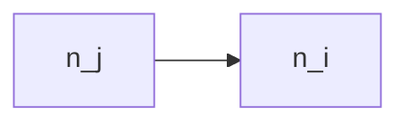
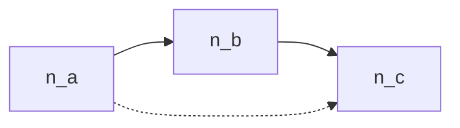
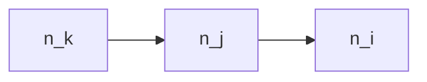
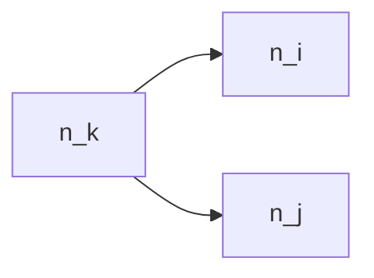
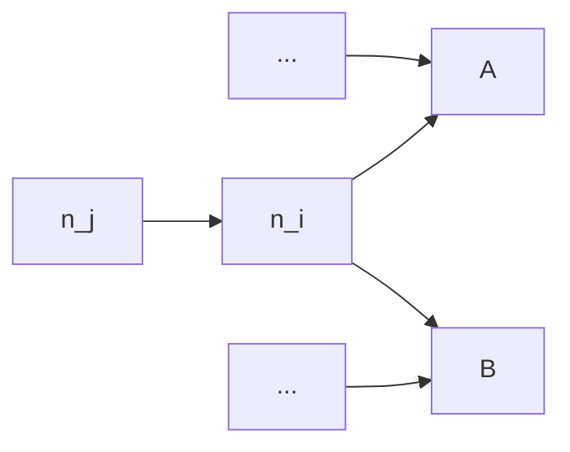
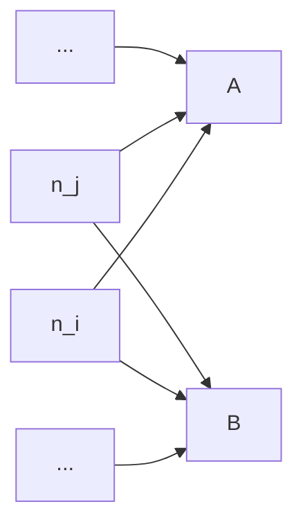

bazel-dep-reduce
================

Dependency Reduction for Bazel

## Pushing the Limit of Previous Works

### Dynamic Dependency Analysis via [`buildfuzz`]

[`buildfuzz`] is basically the reproduction of the build fuzz testing algorithm proposed by 
[`mkcheck`] (https://github.com/nandor/mkcheck) with a new feature:

1. Use **custom touchers** instead of the `touch` file operation, 
   which will **CHANGE** the file content but not affect the original functionality.
1. Use **SHA256** instead of timestamp to detect file changes.
1. **Restore** touched file content after every round.
1. **Rebuild** the project before every round.

You may wonder why we bother changing the source code instead of just touching them. 
The reason is that Bazel has a very powerful dirtiness checking logic, which means, simply touching a file
will not cause Bazel to rebuild.

Do you think custom touchers just add comments into
the source code? If so, you are wrong. We have to make
custom touchers modify the source code that could further
change the object file. Otherwise, we cannot track the 
dependencies between the object files and the linked artifacts
such as the executables. Bazel is too smart to re-link the
object files without real changes of them. 
See [Skyframe - Bazel] for details.

So, what we do with custom touchers is actually adding a dummy
static thing such as static function into the source code.
But it introduces some risks such as unused function warnings, 
which may cause build failures if the project has settings 
to treat warnings as errors. There are also risks like conflicted symbols,
invalid syntaxes in some special contexts (e.g. a header file used as a database) 
and so on.

What's more, even if we added a new function into the source code, there could be 
a chance that the change stop propagating to its dependents 
(e.g. the unused function might be pruned in the object file).
In such cases, we could lose the tracking of dependencies and get inaccurate results.

Anyway, by using custom touchers, we do make it possible to apply the build fuzz 
testing method to Bazel build system.

#### About Redundant Dependency Detection

[`mkcheck`] uses build fuzzing method, which can get more accurate actual dependencies. 
However, in some cases, such as using Java, if you change a library,
and compile an executable depending on this library, even though the executable 
does not use the library in the source code, as long as you specify the dependency 
in the build script, the executable jar will be repackaged, and of course, modified.

Same thing happens for C/C++, while linking `liba.o` and `libb.o` to `main`, 
even though `main` does not need `libb` in its source code. 
Thus, the original [`mkcheck`] cannot detect redundant dependency very well.

To mitigate this issue, we detect file changes by SHA256 instead of the timestamp. This is feasible
because we don't just touch the file but modify the file using custom touchers. And in this way,
we can ensure the modified files are truly changed.

Nevertheless, it can miss some dependencies too. When archiving a
static library depending on other static libraries, it won't actually package those 
dependencies into the current static library. Jar package in Java works similarly.
So, for these kinds of artifacts, if we modify their dependencies, they keep the same.
And their dependencies cannot be captured by [`mkcheck`] or build fuzzing method.

You can try to run [`buildfuzz`] on `examples/kotlin-transitive` project.
And you will find that `libd.jar` only depends on `ClassD.kt`, which
definitely misses a lot.

#### How to Run [`buildfuzz`]

```sh
buildfuzz --input examples/simple-cxx-project \
    --artifact examples/simple-cxx-project/bazel-bin \
    --command buildfuzz/src/test_data/build.sh \
    --output result_deps.log
```

The result is a JSONL file like below.

```
["a.o",["a.h","a.c"]]
["b.o",["b.h","b.c"]]
["main.o",["main.c","a.h","b.h"]]
["main",["main.o","a.o","b.o"]]
```


### Dynamic Dependency Analysis via [`strace_parser`]

[`strace_parser`] is basically the reproduction of [`buildfs`] (https://github.com/theosotr/buildfs) with some improvements:

1. **`stat`/`lstat`/`statfs` syscalls were ignored** because we don't know if the accessed file truly exists, 
   and they are mostly used to detect file changes, i.e., usually not a real sign of file consumption.
1. **Syscalls returning -1** will be ignored, because they failed mostly for inexistent files.
1. **`clone3` syscall was added** for tracing. Otherwise there will be many missing `Newproc` operations.
1. **`--decode-pids=pidns,comm` was added** as the arguments of `strace`, to resolve the pid within a separate namespace, which is the case of Bazel sandboxing. Otherwise, the pids returned by `clone` or `fork` cannot match the pids traced by `strace` in its own namespace, which prevents us from tracing the process relationship correctly.
1. A **virtual filesystem** was implemented to track symlinks. Bazel creates lots of symlinks because of sandboxing.
1. A **`to_link` operation was added** to DSL (IR) to support tracking symlinks.


Though [`buildfs`] claims their approach is applicable to other build systems including Bazel.
The fact is, without our efforts, it is really hard to apply it to Bazel.

See [Sandboxing - Bazel] for details about the sandboxing mechanism in Bazel.

#### About Redundant Dependency Detection

[`buildfs`] does not support to detect redundant dependencies. 
This is because when you specified a dependency in build script,
even if it was not used in the source code, the compiler or linker
will still access the dependency file to finish compilation or linking.

For example, suppose `main.cpp` doesn't include `a.h`, 
but we specify `liba` as a dependency of `main` executable.
When we compile `main.cpp` to `main.o`, the dynamic analysis could work
here, because the compiler will only access all headers included in the `main.cpp`
and does not need to access any other manually-specified dependencies.
However, when it comes to linking, i.e. `main.o` to `main`, all specified
dependencies such as `liba` will be passed to the linker command-line, leading to the file
access on those redundant dependncies. Nothing can be done by dynamic analysis to catch them.

It happens to other programming languages too, especially to those languages without header, such as Java.

[`BuildChecker`] uses the same dynamic approach to detect redundant dependencies.
But in fact, it only supports GNU Make, of which the build dependencies
are based on file instead of target and are more fine-grained. 
So, it could be able to find some of redundant dependency errors, but still has opportunities to miss a lot of them.

#### How to Run `strace`

```sh
bazel clean --expunge
bazel shutdown
strace -s 300 \
    -f \
    -e access,chdir,chmod,chown,clone,clone3,close,dup,dup2,dup3,execve,fchdir,fchmodat,fchownat,fcntl,fork,getxattr,getcwd,lchown,lgetxattr,lremovexattr,lsetxattr,link,linkat,mkdir,mkdirat,mknod,open,openat,readlink,readlinkat,removexattr,rename,renameat,rmdir,symlink,symlinkat,unlink,unlinkat,utime,utimensat,utimes,vfork,write,writev \
    --decode-pids=pidns,comm \
    -o strace.log \
    bash ../build_for_strace.sh
```

#### How to use [`strace_parser`]

```sh
strace_parser -i examples/simple-java-project/strace.log -c examples/simple-java-project -o result_deps.log
```

The result is a JSONL file like below.

```
["a.o",["a.h","a.c"]]
["b.o",["b.h","b.c"]]
["main.o",["main.c","a.h","b.h"]]
["main",["main.o","a.o","b.o"]]
```


## What Makes a Good Dependency Graph?

Our goal is to minimize the number of targets that must be rebuilt when any node in the graph changes.

### Node

Let $n_i$ denote a node in the dependency graph. 
A node may represent a build target, a source file, or a generated file. 

Let $N$ denote the total number of nodes in the graph.

### Dependencies

Let:

- $\text{deps}(n_i)$: the set of all (declared) dependencies of $n_i$
- $\text{deps}_{\text{real}}(n_i)$: the set of all **actual** direct dependencies required for a successful build

#### Transitive Dependencies

```math
\text{deps}_{\text{trans}}(n_i) = \text{deps}(n_i) \cup \bigcup_{n_j \in \text{deps}(n_i)} \text{deps}_{\text{trans}}(n_j)
```

### Dependents

Let $\text{dependents}(n_i)$ denote the set of all nodes that depend on $n_i$, i.e.,

```math
n_j \in \text{dependents}(n_i) \iff n_i \in \text{deps}(n_j)
```

#### Transitive Dependents

```math
\text{dependents}_{\text{trans}}(n_i) = \text{dependents}(n_i) \cup \bigcup_{n_j \in \text{dependents}(n_i)} \text{dependents}_{\text{trans}}(n_j)
```

### Edges

If $n_j \in \text{deps}(n_i)$, we say there is a directed edge $e_{i,j}$ from $n_i$ to $n_j$.

### In-Degree and Out-Degree

- In-degree of $n_i$: number of incoming edges
  $d_{\text{in}}(n_i) = |\text{dependents}(n_i)|$

- Out-degree of $n_i$: number of outgoing edges
  $d_{\text{out}}(n_i) = |\text{deps}(n_i)|$

### Correctness Criterion

A build is considered correct if:

```math
\forall i, \quad \text{deps}_{\text{real}}(n_i) \subseteq \text{deps}_{\text{trans}}(n_i)
```

That is, every actual dependency of a node must be reachable via its declared transitive dependencies.

### Rebuild Set and Rebuild Cost

Let the rebuild set of $n_i$ represented by $R_i$ denote the nodes (excluding $n_i$ itself) that must be rebuilt when $n_i$ changes:

```math
\begin{aligned}
R_i &= \text{dependents}_{\text{trans}}(n_i) \setminus n_i \\
    &= \text{dependents}(n_i) \cup \bigcup_{n_j \in \text{dependents}(n_i)} \text{dependents}_{\text{trans}}(n_j) \setminus n_j \\
    &= \bigcup_{n_j \in \text{dependents}(n_i)} \left(R_j \cup \{n_j\}\right)
\end{aligned}
```

The rebuild cost of $n_i$ is $|R_i|$.

Our global optimization goal is to minimize the sum of the rebuild cost for each node:

```math
\min \sum_{i=1}^N |R_i|
```

If we can minimize each $|R_i|$, the sum will reach its minimum.

## Optimization Strategy via Topological Order

Let $n_1, n_2, \dots, n_N$ be a topological ordering of the nodes such that:

```math
n_j \in \text{deps}(n_i) \Rightarrow j > i \quad \text{and} \quad n_j \in \text{dependents}(n_i) \Rightarrow j < i
```

This implies:

```math
\begin{aligned}
\text{dependents}(n_i) &\subseteq \{ n_j \mid j < i \} \\
\text{deps}(n_i) &\subseteq \{ n_j \mid j > i \}
\end{aligned}
```

We process nodes in increasing topological order to minimize $R_i$ incrementally.

For instance:

```math
\text{dependents}(n_1) = \emptyset \Longrightarrow R_1 = \emptyset
```

In other words, nothing can be done to optimize $R_1$ as it is already an empty set.

For $n_i$ in general:

```math
R_i = \bigcup_{n_j \in \text{dependents}(n_i)} \left(R_j \cup \{n_j\}\right) 
```

Because we optimize $R_i$ in topological order, all $R_j$ with $j < i$ must have already been reduced,
which means all $n_j \in \text{dependents}(n_i)  \subseteq \{ n_j \mid j < i \}$ have already
been reduced and determined.

We can now treat all $R_j$ s as constants and focus on reducing $R_i$.

### How to Minimize Each $R_i$?

We can minimize each $R_i$ in topological order to minimize the overall rebuild cost. 
Now, let's look at how to minimize each $R_i$.

```math
\min |R_i| = \min \left| \bigcup_{n_j \in \text{dependents}(n_i)} \left(R_j \cup \{n_j\}\right) \right|
```

Because all $R_j$ s can be viewed as constants, the only thing we can do with this formula is to remove
dependents of $n_i$.

We will process each $n_j \in \text{dependents}(n_i)$ in reverse topological order.

1. Remove $n_j \rightarrow n_i$ and attempt to build.
1. If it fails, add $n_i$ as a dependency to all $\text{dependents}(n_j)$ and retry.
1. If still failing, replace $n_i$ with $\text{deps}(n_i)$ in $n_j$'s dependency list and try again.
1. If all fail, retain the original edge.

#### Step 1: Direct Edge Removal

Step 1 works as a short path to avoid the complicated operations in the following steps.



Let $`R'_*`$ be the updated $`R_*`$ after optimization.

After removal, $R_i = R_i' \cup \{n_j\} \cup R_j \Rightarrow |R_i| \geq |R_i'|$.

The following example shows when the formula above takes the equality.



By removing the edge $n_a \rightarrow n_c$, $R_c' = \{n_a, n_b\} = R_c$.


#### Step 2: Dependency Lifting

Step 2 reduces rebuilds by associating dependencies more directly with the nodes that actually use them, eliminating redundant intermediaries.

Suppose the build dependency is declared as below and we are currently considering to remove the edge $n_j \rightarrow n_i$:



If $n_j$ actually does not depend on $n_i$, our optimization goal will be:



However, step 1 will fail because $n_k$ may still depend on $n_i$ and we cannot directly remove
the edge $n_j \rightarrow n_i$.

To achieve this, we need to lift the dependency $n_i$ from $n_j$ to all dependents of $n_j$, which includes $n_k$.
In other words, we will add edges $n_k \rightarrow n_i$ for every $n_k \in \text{dependents}(n_j)$, and 
then remove the edge $n_j \rightarrow n_i$.

After optimization, only $R_i$ will be affected.

```math
\begin{align*}
R_k &= R_k' \quad \forall n_k \in \text{dependents}(n_j) \qquad & \text{(no change)} \\
R_j &= R_j' & \text{(no change)} \\
R_i &= R_i' \cup \{n_j\} \Rightarrow |R_i| \geq |R_i'|
\end{align*}
```

<details>
<summary>Detailed Proof</summary>

```math
\begin{align*}
&\begin{cases}
R_i' &= \bigcup_{n_k \in \left[\text{dependents}(n_i) \setminus n_j \cup \text{dependents}(n_j)\right]} (R_k \cup \{n_k\}) \\
     &= \bigcup_{n_k \in \text{dependents}(n_i) \setminus n_j} (R_k \cup \{n_k\}) \; \cup \; \left(\bigcup_{n_k \in \text{dependents}(n_j)} (R_k \cup \{n_k\})\right) \\

R_i &= \bigcup_{n_k \in \text{dependents}(n_i)}(R_k \cup \{n_k\}) \\
    &= \bigcup_{n_k \in \text{dependents}(n_i) \setminus n_j}(R_k \cup \{n_k\}) \; \cup \; (R_j \cup \{n_j\}) \\
    &= \bigcup_{n_k \in \text{dependents}(n_i) \setminus n_j}(R_k \cup \{n_k\}) \; \cup \; \left(\bigcup_{n_k \in \text{dependents}(n_j)}(R_k \cup \{n_k\})\right) \cup \{n_j\} \\
\end{cases} \\
\Rightarrow & R_i = R_i' \cup \{n_j\}
\end{align*}
```
</details>

##### Further Optimization for Added Edges

We mentioned that dependents of $n_i$ are considered for removal in reversed topological order.
Since $n_k \in \text{dependents}(n_j)$, $n_k$ appears after $n_j$ in the reverse topological order.
Thus, the added edges $n_k \rightarrow n_i$ will be tried to remove when we consider the following $n_j$ s in the queue. 

The queue should be a priority queue sorted by reverse topological order of the nodes, and every time we add a new edge, we need to insert the new dependents into the queue. 
This allows the dependency to be recursively lifted to the nodes that truly require it in only one pass. 


#### Step 3: Dependency Flattening

Step 3 copies all dependencies of $n_i$ to $n_j$, which is like expanding the dependencies of $n_i$ for $n_j$
and make the dependencies of $n_j$ more flat.

Suppose we have a declared dependency graph as below.



If $n_j$ depends on all $\text{deps}(n_i)$ but not actually depend on $n_i$ itself,
we need to add all $\text{deps}(n_i)$ as dependencies of $n_j$ before we can
remove $n_j \rightarrow n_i$.

After optimization, the dependency graph will become:



Let's see the change of rebuild cost.

```math
\begin{align*}
R_i &= R_i' \cup \{n_j\} \cup R_j \\
R_A &= R_A' \\
R_B &= R_B' \\
\end{align*}
```

Only $R_i$ will be changed and $|R_i| \geq |R_i'|$.

##### Further Optimization for Added Edges

The dependencies added to $n_j$ are also dependencies of $n_i$, which appear
after $n_i$ in topological order. Hence, when we minimize the rebuild cost of later nodes
in topological order, we still have the opportunity to remove these added edges in the same pass.

#### Summary

We proved that all 3 steps are able to reduce the nodes in the rebuild set $R$, or at least keep the same nodes in some rare cases. 

In addition, even though many edges may be added in step 2 and step 3, we also proved that
there are opportunities to remove these newly-added edges within the same optimization pass.

In terms of efficiency, because we minimize the rebuild cost in topological order, when we
try to remove edges for a node and trigger a rebuild, we have already minimized all its
dependents, which means the incremental rebuild can be done as fast as we can expect.

### How to Avoid Unexpected Architectural Changes

#### Missing Direct Dependencies

See [Bazel - Dependencies](https://bazel.build/concepts/dependencies#actual-and-declared-dependencies) for an example of the hazard
introduced by missing direct dependencies.

Because our approach will try to remove every edge in the dependency graph,
it will remove the dependencies that can be accessed from transitive
dependencies, even if these dependencies are directly used by the current target.

This won't be a big issue, since if someone did refactor the code and
break the dependencies, the build will be broken and developers can
locate and fix the issue easily. However, it still can be an unexpected
architectural change as well as a regression in the build code, which makes
the dependency reduction result hard to be accepted.

To mitigate this issue, we provide an option to check an additional condition
before we try to remove the edge $n_j \rightarrow n_i$:
If $n_i \in \text{deps}_{\text{trans}}(n_k)$ where $n_k \in \text{deps}(n_j)$, 
which means even if we removed $n_j \rightarrow n_i$, $n_j$ still transitively depends on $n_i$,
let's just keep this edge and skip the following steps.

As we considered the dependents $n_j$ in reverse topological order, 
all $\text{deps}_{\text{trans}}(n_k)$ where $n_k \in \text{deps}(n_j)$
are determined. Thus, we can still finish the optimization process in one pass.

As a bonus, because we have less edges to remove, the rebuild times are reduced, and the optimization
can be done faster.

#### Rules that Should Remain Untouched

We support allowlist and blocklist where users can specify texts or regexes to match rules. Only dependencies declared via allowed or not-blocked rules can be modified.

See [blockrules.txt](blockrules.txt) as an example.

## Implementation

### Static Dependency Analysis via [`depreduce`]

[`depreduce`] is a novel tool for static dependency analysis and reduction proposed by us.

It will use a custom build script as the test oracle, and try to
reduce dependencies in the approach we proposed above.

#### Get Dependency Graph from Bazel Query

[`depreduce`] parses the dependency graph in the XML format output by Bazel Query:

```sh
bazel query "deps(//...)" --notool_deps --noimplicit_deps --output xml
```

> The query command will be executed by [`depreduce`]. You don't have to run it by yourself. But of course you can run it to see what it is.

#### How to Run [`depreduce`]

```sh
depreduce --workspace /data/h445xu/repo/perses-private --command scripts/build_perses.sh
```

Some tips for build script:

- Remember to `set -e` in your script if it has more than 1 line of code.
- Use `--notest_keep_going` for `bazel test` command to fail fast.

[`buildfs`]: https://dl.acm.org/doi/10.1145/3428212
[`BuildChecker`]: https://ieeexplore.ieee.org/document/10981616
[`mkcheck`]: https://ieeexplore.ieee.org/document/8812082
[Skyframe - Bazel]: https://bazel.build/reference/skyframe
[Sandboxing - Bazel]: https://bazel.build/docs/sandboxing
[`buildfuzz`]: buildfuzz
[`strace_parser`]: strace_parser
[`depreduce`]: depreduce