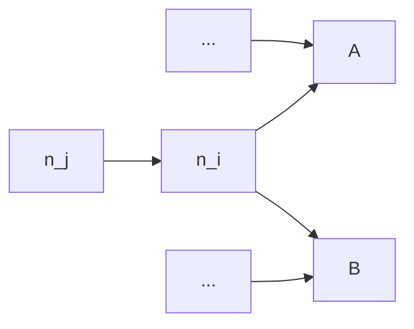
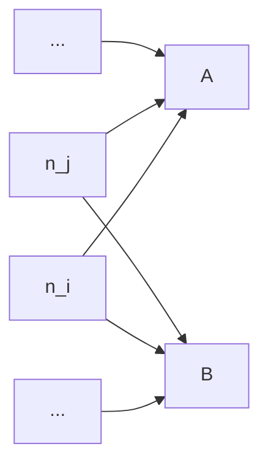

bazel-dep-reduce
================

Dependency Reduction for Bazel

## Pushing the Limit of Previous Works

### Dynamic Dependency Analysis via `buildfuzz`

`buildfuzz` is basically the reproduction of the build fuzz testing algorithm proposed by 
[`mkcheck`] (https://github.com/nandor/mkcheck) with a new feature:

1. Use **custom touchers** instead of the `touch` file operation, 
   which will **CHANGE** the file content but not affect the original functionality.
1. Use **SHA256** instead of timestamp to detect file changes.
1. **Restore** touched file content after every round.
1. **Rebuild** the project before every round.

You may wonder why we bother changing the source code instead of just touching them. 
The reason is that Bazel has a very powerful dirtiness checking logic, which means, simply touching a file
will not cause Bazel to rebuild.

Do you think custom touchers just add comments into
the source code? If so, you are wrong. We have to make
custom touchers modify the source code that could further
change the object file. Otherwise, we cannot track the 
dependencies between the object files and the linked artifacts
such as the executables. Bazel is too smart to re-link the
object files without real changes of them. 
See [Skyframe - Bazel] for details.

So, what we do with custom touchers is actually adding a dummy
static thing such as static function into the source code.
But it introduces some risks such as unused function warnings, 
which may cause build failures if the project has settings 
to treat warnings as errors. There are also risks like conflicted symbols,
invalid syntaxes in some special contexts (e.g. a header file used as a database) 
and so on.

What's more, even if we added a new function into the source code, there could be 
a chance that the change stop propagating to its dependents 
(e.g. the unused function might be pruned in the object file).
In such cases, we could lose the tracking of dependencies and get inaccurate results.

Anyway, by using custom touchers, we do make it possible to apply the build fuzz 
testing method to Bazel build system.

#### About Redundant Dependency Detection

[`mkcheck`] uses build fuzzing method, which can get more accurate actual dependencies. 
However, in some cases, such as using Java, if you change a library,
and compile an executable depending on this library, even though the executable 
does not use the library in the source code, as long as you specify the dependency 
in the build script, the executable jar will be repackaged, and of course, modified.

Same thing happens while linking `liba.o` and `libb.o` to `main`, even though `main` does not need `libb`
in its source code. Thus, the original [`mkcheck`] cannot detect redundant dependency very well, especially
for linking and higher level programming languages.

To mitigate this issue, we detect file changes by SHA256 instead of the timestamp. This is feasible
because we don't just touch the file but modify the file using custom touchers. And in this way,
we can ensure the modified files are truly changed.

#### How to Run `buildfuzz`

```sh
buildfuzz --input examples/simple-cxx-project \
    --artifact examples/simple-cxx-project/bazel-bin \
    --command buildfuzz/src/test_data/build.sh \
    --output result_deps.log
```

The result is a JSONL file like below.

```
["a.o",["a.h","a.c"]]
["b.o",["b.h","b.c"]]
["main.o",["main.c","a.h","b.h"]]
["main",["main.o","a.o","b.o"]]
```


### Dynamic Dependency Analaysis via `strace`

`strace_parser` is basically the reproduction of [`buildfs`] (https://github.com/theosotr/buildfs) with some improvements:

1. **`stat`/`lstat`/`statfs` syscalls were ignored** because we don't know if the accessed file truly exists, 
   and they are mostly used to detect file changes, i.e., usually not a real sign of file consumption.
1. **Syscalls returning -1** will be ignored, because they failed mostly for inexistent files.
1. **`clone3` syscall was added** for tracing. Otherwise there will be many missing `Newproc` operations.
1. **`--decode-pids=pidns,comm` was added** as the arguments of `strace`, to resolve the pid within a separate namespace, which is the case of Bazel sandboxing. Otherwise, the pids returned by `clone` or `fork` cannot match the pids traced by `strace` in its own namespace, which prevents us from tracing the process relationship correctly.
1. A **virtual filesystem** was implemented to track symlinks. Bazel creates lots of symlinks because of sandboxing.
1. A **`to_link` operation was added** to DSL (IR) to support tracking symlinks.


Though [`buildfs`] claims their approach is applicable to other build systems including Bazel.
The fact is, without our efforts, it is really hard to apply it to Bazel.

See [Sandboxing - Bazel] for details about the sandboxing mechanism in Bazel.

#### About Redundant Dependency Detection

[`buildfs`] does not support to detect redundant dependencies. 
This is because when you specified a dependency in build script,
even if it was not used in the source code, the compiler or linker
will still access the dependency file to finish compilation or linking.

For example, suppose `main.cpp` doesn't include `a.h`, 
but we specify `liba` as a dependency of `main` executable.
When we compile `main.cpp` to `main.o`, the dynamic analysis could work
here, because the compiler will only access all headers included in the `main.cpp`
and does not need to access any other manually-specified dependencies.
However, when it comes to linking, i.e. `main.o` to `main`, all specified
dependencies such as `liba` will be passed to the linker command-line, leading to the file
access on those redundant dependncies. Nothing can be done by dynamic analysis to catch them.

It happens to other programming languages too, especially to those languages without header, such as Java.

[`BuildChecker`] uses the same dynamic approach to detect redundant dependencies.
But in fact, it only supports GNU Make, of which the build dependencies
are based on file instead of target and are more fine-grained. 
So, it could be able to find some of redundant dependency errors, but still has opportunities to miss a lot of them.

#### How to Run `strace`

```sh
bazel clean --expunge
bazel shutdown
strace -s 300 \
    -f \
    -e access,chdir,chmod,chown,clone,clone3,close,dup,dup2,dup3,execve,fchdir,fchmodat,fchownat,fcntl,fork,getxattr,getcwd,lchown,lgetxattr,lremovexattr,lsetxattr,link,linkat,mkdir,mkdirat,mknod,open,openat,readlink,readlinkat,removexattr,rename,renameat,rmdir,symlink,symlinkat,unlink,unlinkat,utime,utimensat,utimes,vfork,write,writev \
    --decode-pids=pidns,comm \
    -o strace.log \
    bash ../build.sh
```

#### How to use `strace_parser`

```sh
strace_parser -i examples/simple-java-project/strace.log -c examples/simple-java-project -o result_deps.log
```

The result is a JSONL file like below.

```
["a.o",["a.h","a.c"]]
["b.o",["b.h","b.c"]]
["main.o",["main.c","a.h","b.h"]]
["main",["main.o","a.o","b.o"]]
```


## What is a Good Dependency Graph

Our goal is to minimize the number of targets to be rebuilt after
changes of any target.

### Node

A node $n_i$ in the dependency graph can be a build target, a source file, or
a generated file.

Let $N$ be the total number of nodes in the graph.

### Dependencies

Let $deps(n_i)$ be the set of all dependencies that $n_i$ depends on in the graph,
and $deps_{real}(n_i)$ be the set of all **real** direct dependencies that $n_i$ depends on.

#### Transitive Dependencies

$$
deps_{transitive}(n_i) = \bigcup_{\forall n_j \in deps(n_i)} \left[deps(n_j) \cup deps_{transitive}(n_j)\right]
$$

### Dependents

Let $dependents(n_i)$ be the set of all dependents of $n_i$, i.e., all nodes that 
depends on $n_i$ in the graph.

So, $n_j \in dependents(n_i) \Leftrightarrow n_i \in dependents(n_j)$.

### Edge

When $n_j \in deps(n_i)$ or $n_i \in dependents(n_j)$,
we say there is a directed edge $e_{i,j}$.

### In-Degree and Out-Degree

The in-degree $d_{in}(n_i)$ represents the number of incoming edges for the node $n_i$. 

And the out-degree $d_{out}(n_i)$ represents the number of outcoming edges for the node $n_i$. 

$$
\begin{align*}
d_{in}(n_i) &= \sum_{\forall n_j \in dependents(n_i)} 1 \\
d_{out}(n_i)  &= \sum_{\forall n_j \in deps(n_i)} 1
\end{align*}
$$

### Successful Build

The build will succeed if

$$
\forall i, deps_{real}(n_i) \subseteq \left[deps(n_i) \cup deps_{transitive}(n_i)\right]
$$

### The Number of Targets to Rebuild

Suppose $R_i$ is the number of targets except itself that will be rebuilt after $n_i$
changed.

$$
\begin{split}
R_i &= d_{in}(n_i) + \sum_{\forall n_j \in dependents(n_i)} R_j \\
    &= \sum_{\forall n_j \in dependents(n_i)} (1 + R_j)
\end{split}
$$

So, our goal is to:

$$
\min R_{sum} = \min \sum_i^N R_i
$$

### Minimize $R$ in Topological Order

Suppose $n_1 \leq n_2 \leq \dots \leq n_N$ after topological sort on dependencies.

We have:
$$
\begin{align*}
deps(n_1) & = \emptyset \\
dependents(n_N) & = \emptyset \\
n_j \in deps(n_i) & \Rightarrow j < i \Rightarrow n_j \leq n_i \\
deps(n_i) & \subseteq \left\{ n_j | j < i \right\} \\
n_j \in dependents(n_i) & \Rightarrow j > i \Rightarrow n_j \geq n_i \\
dependents(n_i) & \subseteq \left\{ n_j | j > i \right\}
\end{align*}
$$

Because $R_i$ of $n_i$ is only relevant to $R_j$ of the dependents of $n_i$,
we can minimize $R_i$ in the **reversed** topological order.

For example, first consider the $n_N$,
$$
dependents(n_N) = \emptyset \Longrightarrow R_N = 0
$$

We have nothing to do with minimizing the $R_N$ for $n_N$, as it is already $0$.

Now let's look at $n_{i}$,
$$
\begin{split}
& dependents(n_i) \subseteq \left\{ n_j | j > i \right\} \\
\Longrightarrow \quad & R_i = \sum_{\forall n_j \in dependents(n_i) \subseteq \left\{ n_j | j > i \right\}} (1 + R_j) \\
\Longrightarrow \quad & R_i = \left|dependents(n_i)\right| + \sum_{\forall n_j \in dependents(n_i) \subseteq \left\{ n_j | j > i \right\}} R_j
\end{split}
$$

Remember that we minimize $R_*$ from $R_N$ to $R_1$, which means, at the moment, all $R_j \text{s}$ such that $j > i$ have already been minimized.

So, to minimize $R_i$, we only need to minimize the number of dependents for each $n_i$.

### How to Minimize Dependents?

For each node $n_i$, 

1. Remove $n_j \in dependents(n_i)$ and rebuild the project to validate the change.
1. If build fails, add $deps(n_i)$ to $n_j$ and rebuild the project.
1. If build still fails, give up removing $n_j$.

You may wonder whether the 2nd step really reduce the sum of $R$,
as it adds some new dependencies and seems to increase the $R_k$ at the same time where $n_k \in deps(n_i)$.

In fact, $R_k$ won't be changed. Let's do some calculations.

#### Why Replacing Useless Dependency with Its Dependencies Work?

##### Before



##### After



Suppose $n_j$ depends on all $deps(n_i)$ transitively inherited from $n_i \in deps(n_j)$, but 
does not actually depend on $n_i$.
In such case, after replacing the $n_i$ with all its dependencies as the dependencies of $n_j$, 
there will be no other available optimization.
Let's see the change of $R$ for this. 

Let $R_*'$ be the updated value of $R_*$.

For $n_i$ that is currently being optimized, $R_i' = R_i - (1 + R_j)$.

For $n_k \in deps(n_i)$, let $D_k$ be $dependents(n_k)$ before optimization and $D_k'$ be $dependents(n_k)$ after optimization.

We have $D_k' = D_k \cup n_j$. And for $\forall n_t \in D_k \setminus n_i$, there is no change to $R_t$, i.e., $R_t' = R_t$.

$$
\begin{split}
R_k & = \sum_{\forall n_t \in D_k} (1 + R_t) \\
    & = \sum_{\forall n_t \in D_k \setminus n_i} (1 + R_t) + (1 + R_i) \\
\\
R_k' & = \sum_{\forall n_t \in D_k' \setminus n_i} (1 + R_t') + (1 + R_i') \\
     & = \sum_{\forall n_t \in D_k \cup n_j \setminus n_i} (1 + R_t') + (1 + R_i') \\
     & = \sum_{\forall n_t \in D_k \setminus n_i} (1 + R_t') + (1 + R_j) + (1 + R_i') \\
     & = \sum_{\forall n_t \in D_k \setminus n_i} (1 + R_t) + (1 + R_j) + (1 + R_i - (1 + R_j)) \\
     & = \sum_{\forall n_t \in D_k \setminus n_i} (1 + R_t) + (1 + R_i) \\
     & = R_k
\end{split}
$$

So, $R_k$ actually does not change and $R_i$ decreased by $1 + R_j$. 
The overall sum of $R$ will be definitely reduced.


## Usage

### Static Dependency Analysis via `depreduce`

`depreduce` is a novel tool for static dependency analysis and reduction proposed by ourself.

#### Get Dependency Graph from Bazel Query

`depreduce` can parse the dependency graph in the XML format output by Bazel Query:

```sh
bazel query "deps(//...)" --notool_deps --output xml
```


[`buildfs`]: https://dl.acm.org/doi/10.1145/3428212
[`BuildChecker`]: https://ieeexplore.ieee.org/document/10981616
[`mkcheck`]: https://ieeexplore.ieee.org/document/8812082
[Skyframe - Bazel]: https://bazel.build/reference/skyframe
[Sandboxing - Bazel]: https://bazel.build/docs/sandboxing