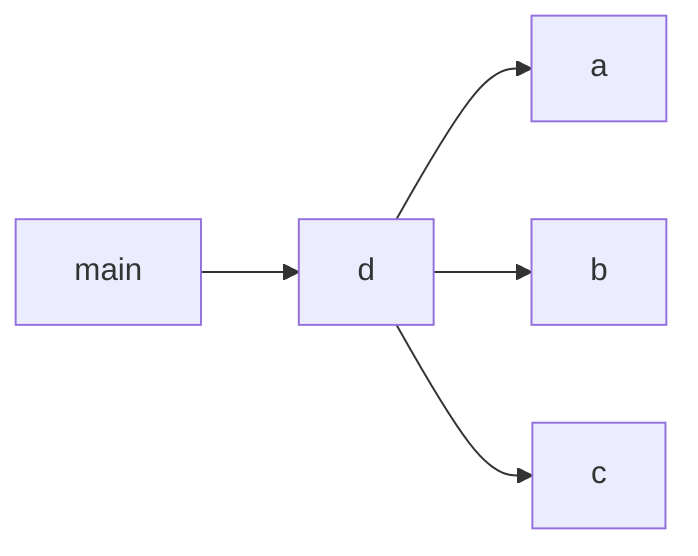
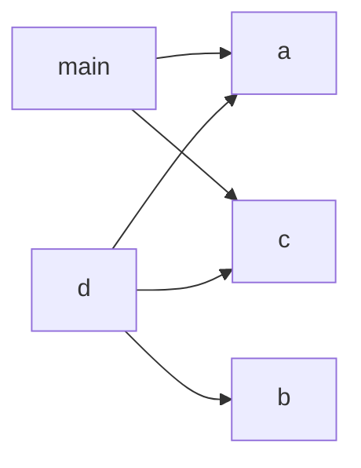

# kotlin-transitive

In this project, `main -> a & d` and `d -> a & b & c`. But `main` only actually uses `a & c` without `d`.
So we can remove `d`, but add `c` as the dependencies of `main`.

What we want to test it whether the reducer can add deps of deps correctly, and
it also needs to deduplicate the added deps because main already depends on a.

## Before

## After

